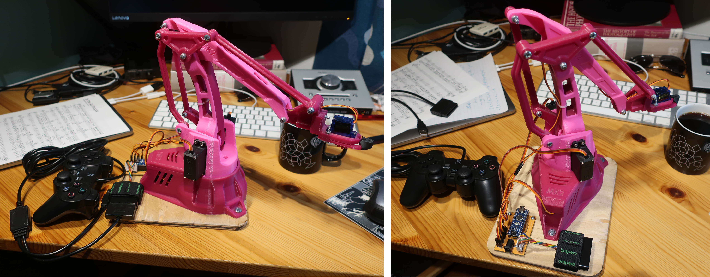
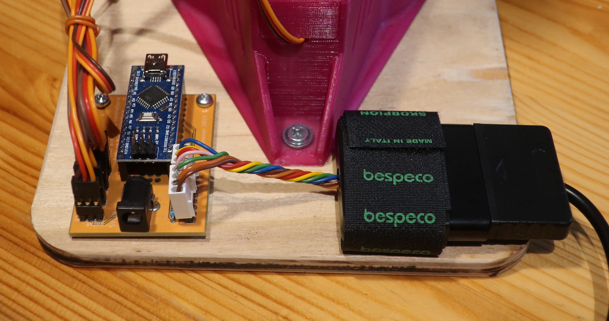
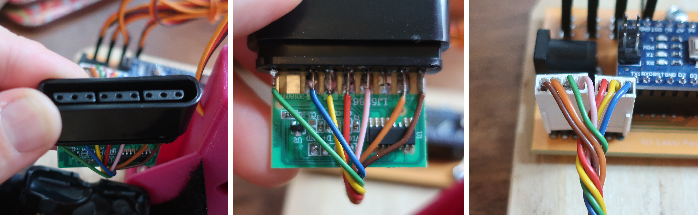
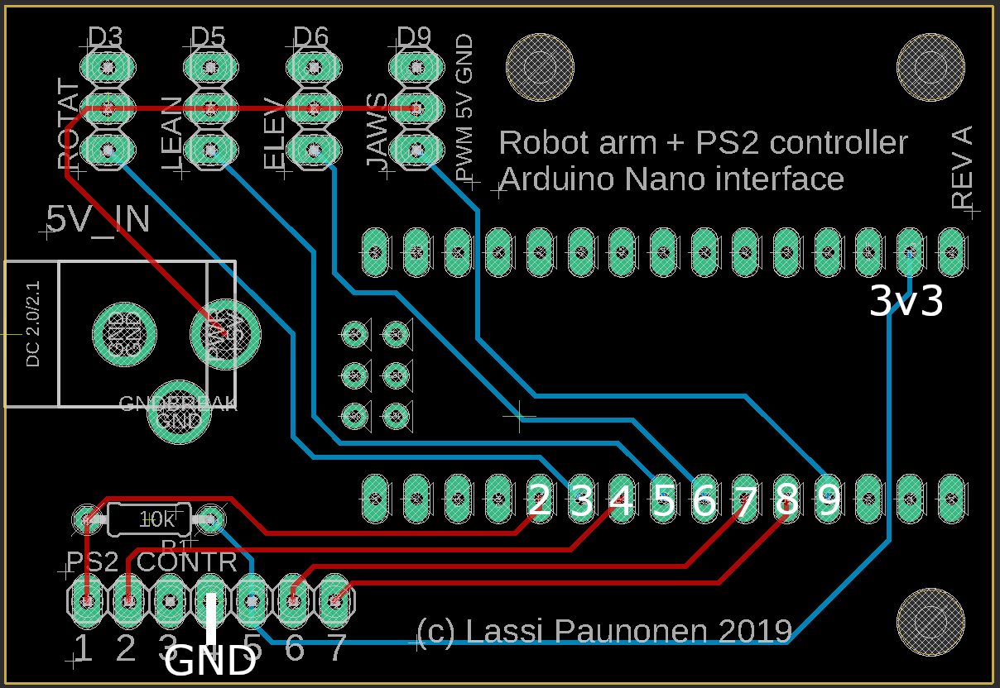

# EEZYbot Robotic Arm with PS2 Controller

This repository contains the Arduino code for controlling a 3D printed EEZYbot MK2 robotic arm (designed by Carlo Franciscone (daGHIZmo) in Thingiverse) using a Playstation 2 Dualshock controller. In addition, the repository contains Gerber files for a PCB which can be used to connect the robotic arm servo motors and the PS2 controller to an Arduino Nano.

## Requirements

The EEZYbot MK2 robotic arm design by daGHIZmo can be found in Thingiverse at https://www.thingiverse.com/thing:1454048

The Arduino code requires the PS2X library (1.6 or newer) for interacting with the PS2 controller. The library is available at https://github.com/madsci1016/Arduino-PS2X

There's also a good tutorial on connecting the PS2 controller to Arduino in Youtube at https://www.youtube.com/watch?v=xlupRVF_6W8

## Demonstration video

## Installation

### Connections and Wiring

#### Using the connection shield PCB

The servos and a connector plug for the Playstation 2 controller can be connected directly to the connection shield PCB. 

The following figures describe the orientations of the servo connectors and the ordering of the wires between the PS2 controller plug and the connection board. The wires inside the PS2 controller cord can of course be wired directly to the board, but I found it easier to solder the wires instead to a connector plug. The connector I used comes from a cheap USB-adapter for PS2 controllers, which I took apart. This way the same controller can also be used for different projects.

#### Other ways of wiring

The connections to the servos and the controller can alternatively done on a breadboard. The following figure describes the connections between the wires of the PS2 controller and Arduino Nano (Digital pins D2, D4, D7 and D8, the 3.3V power pin, and the ground pin). The PWM pins of the servos can alternatively be connected to any available digital pins with PWM capability, by default D3 ('rotation'), D5 ('lean'), D6 ('elevation'), and D9 ('jaws') (if other pins are used, the numbers can be redefined in the code).

### Software installation

Compile the Arduino code file 'EEZYbot_PS2X_control/EEZYbot_PS2X_control.ino' and upload it to the Arduino.

## Usage

The Arduino code file contains limits for the servo angles in order to prevent the servos from jamming against an obstacle (which can lead to excessive current draw and cause the Arduino to reboot). These should be modified to correspond to the angles of the individual EEZYbot arm (depending on what are the more precise initial angles of the servos).

The Arduino needs to be turned on (or rebooted) after plugging in the controller.

By default, the buttons L1 and R1 control the opening and closing of the jaws and the two joysticks control the other movements of the robot (in the code, labeled as "elevation", "lean" and "rotation").

## License

Copyright (C) 2019 by Lassi Paunonen.

The Arduino code file EEZYbot_PS2X_control.ino is free software: you can
redistribute it and/or modify it under the terms of the GNU General
Public License as published by the Free Software Foundation, 
either version 3 of the License, or (at your option) any later version.

This program is distributed in the hope that it will be useful,
but WITHOUT ANY WARRANTY; without even the implied warranty of
MERCHANTABILITY or FITNESS FOR A PARTICULAR PURPOSE.  See the
GNU General Public License for more details.

For a copy of the GNU General Public License, see <https://www.gnu.org/licenses/gpl.txt>.

The Gerber files for the Arduino Nano connection board can be used freely for non-commercial purposes. Their use for commercial purposes requires a permission from the owner of this repository.

